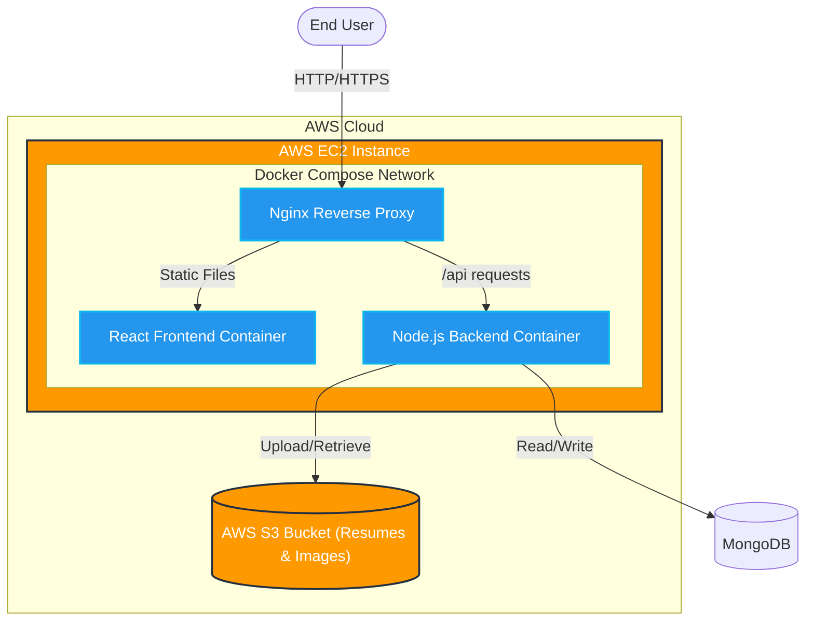
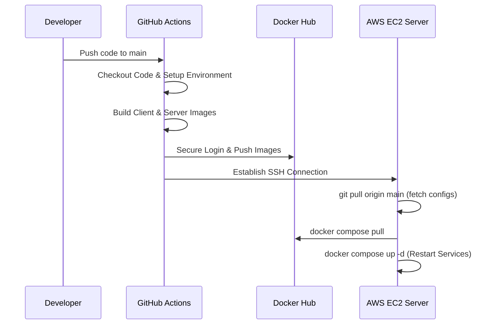

# Rozgaarsathi - Cloud Infrastructure Showcase

Rozgaarsathi is a modern web application designed to connect local talent with local opportunities, empowering workers and employers across India. 

**This repository highlights the Cloud Engineering, DevOps, and System Design aspects of the project.**

## 🚀 Cloud Engineering & DevOps Highlights

As a Cloud Engineer, my focus on this project was to establish a robust, scalable, and automated infrastructure. Key achievements include:

- **End-to-End CI/CD Pipeline**: Designed and implemented automated workflows using **GitHub Actions**. Code pushes automatically trigger testing, Docker image building, and deployment to production.
- **Containerization**: Fully containerized the application using **Docker**. Created independent `client` and `server` containers orchestrated via **Docker Compose**, ensuring parity between development and production environments.
- **AWS Infrastructure Deployment**: Provisioned and configured **AWS EC2** instances to host the application. Secured the server and configured SSH-based automated deployments.
- **Cloud Storage Integration**: Integrated **AWS S3** for scalable and secure storage of user-uploaded assets (resumes and profile pictures), offloading file storage from the application server.
- **Reverse Proxy & Web Server**: Configured **Nginx** to serve the optimized React frontend and act as a reverse proxy, routing API requests securely to the Node.js backend.

## 🏗️ System Architecture & Design

The application follows a microservices-inspired architecture running within a containerized environment on AWS. 



## 🔄 CI/CD Pipeline Workflow

The continuous integration and continuous deployment pipeline is fully automated to ensure reliable and fast deployments. When code is merged to the `main` branch, the following sequence occurs:



1. **Build Phase**: GitHub Actions checks out the code and builds the Docker images for both the frontend (`rozgaarsathi-client`) and backend (`rozgaarsathi-server`).
2. **Registry Push**: The built images are securely tagged and pushed to **Docker Hub**.
3. **Deployment Phase**: GitHub Actions establishes an SSH connection to the **AWS EC2** instance using repository secrets.
4. **Orchestration**: The EC2 instance pulls the latest images and uses `docker compose up -d --build` to apply zero-downtime updates.

## 🛠️ Tech Stack & Tools

- **Cloud Provider**: AWS (EC2, S3)
- **Containerization**: Docker, Docker Compose
- **CI/CD**: GitHub Actions
- **Web Server / Reverse Proxy**: Nginx
- **Frontend**: React.js, Tailwind CSS
- **Backend**: Node.js, Express.js
- **Database**: MongoDB

## 📝 Running Locally

To spin up the entire infrastructure locally using Docker:

```bash
# Clone the repository
git clone https://github.com/yourusername/Rozgaarsathi.git
cd Rozgaarsathi

# Start the application using Docker Compose
docker-compose up --build
```
The application will be available at `http://localhost`, with the backend API accessible internally on port `3000`.

---
*This README focuses on the infrastructure and DevOps implementation. For detailed application code and features, please explore the `client` and `server` directories.*
